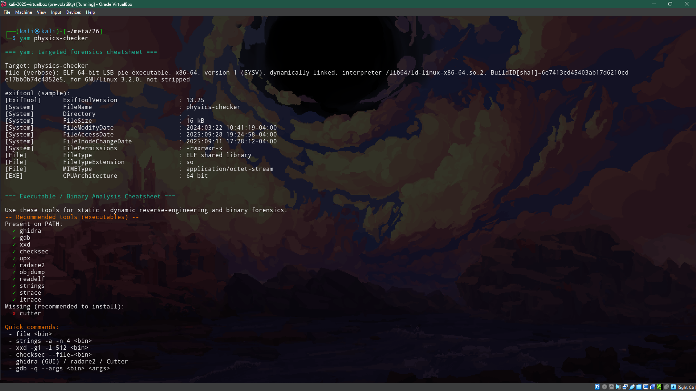

# yam — CTF & Forensics Cheatsheet Tool

## What it is
yam is a small command-line helper that inspects a file (using `file` and `exiftool`) and prints a focused, practical cheatsheet of tools and commands to use for CTF / forensic analysis (images, PDFs, archives, PCAPs, media, text, etc.). It does **not** execute unknown binaries.

## How to install
1. Clone the repo:

```bash
git clone https://github.com/yam0822/yam.git && cd yam
```

2. Add to path
```bash
sudo mv yam /usr/local/bin
```

3. Make executable
```bash
chmod +x /usr/local/bin/yam
```

## Example Usage

Run `yam` with a target file to get a targeted cheatsheet:

```bash
yam physics-checker
```


## Disclaimer
yam is intended for educational purposes and CTF / forensic analysis in controlled environments. Do not run unknown binaries on your main system; use a sandbox or VM. The author is not responsible for misuse.
